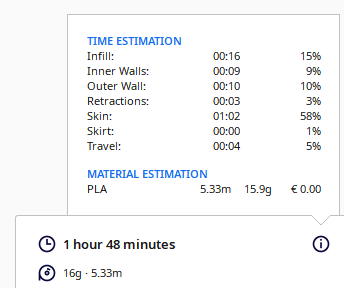
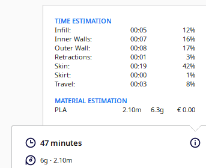
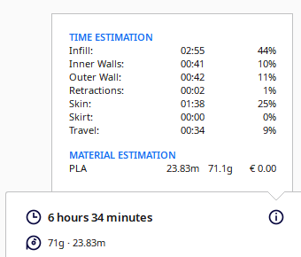
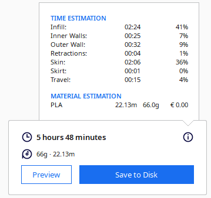

# Game Hardware Assignment 3

### Logic Gate: Alvin Ng, Jeff Lundy

### 3D Printing Simulation Videos

Video link: [Arduino Holder](https://drive.google.com/file/d/18fG9CJ-AW-lAVXvCI5jLfbvs-2fUEZ6d/view?usp=share_link "Video")

Video link: [Slider](https://drive.google.com/file/d/19lkYL7j8-BWxRAXVNxAz0OU0V--0ofwt/view?usp=share_link "Video")

Video link: [Stir Device](https://drive.google.com/file/d/1tF_vp9ALsJ4idD1BSGp1NogTYcqLApJ2/view?usp=share_link "Video")

Video link: [Push Block](https://drive.google.com/file/d/1JC7s7VEgbHY5Vmnni2e8xUxAYzhHTE7K/view?usp=share_link "Video")

### 3D Printing Stats (3D Print Time + Material)

Arduino Holder: 

Slider: 

Stir Device: 

Push Block: 

